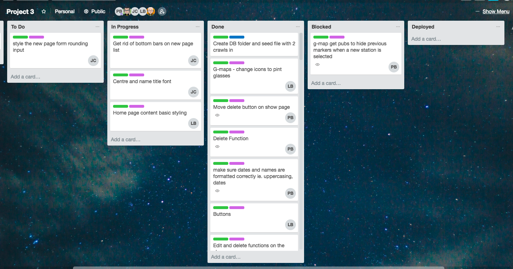
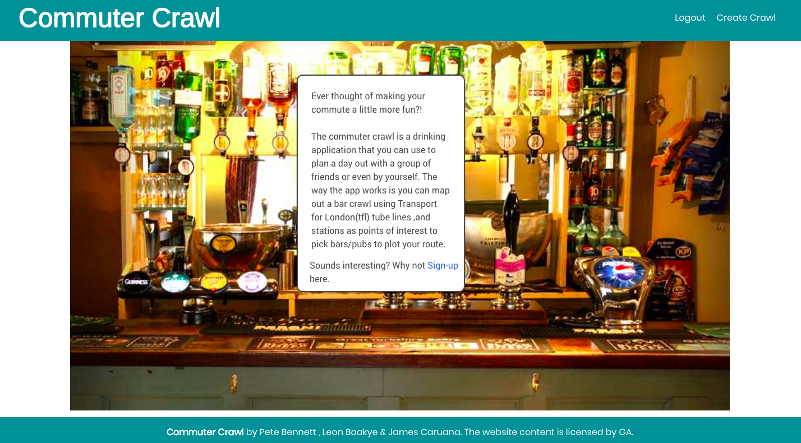
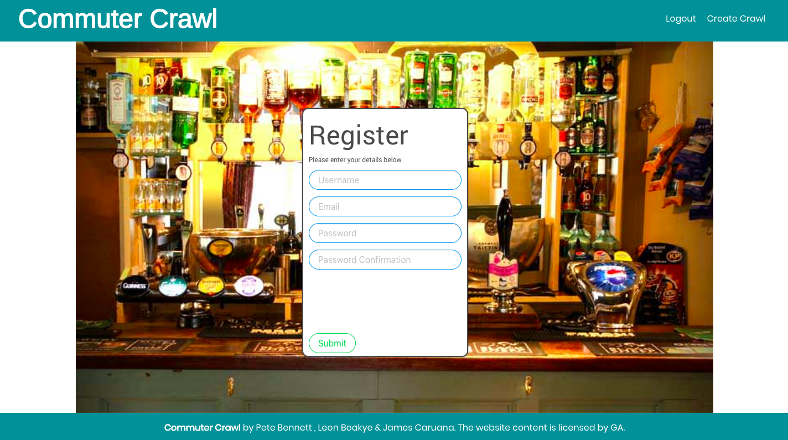
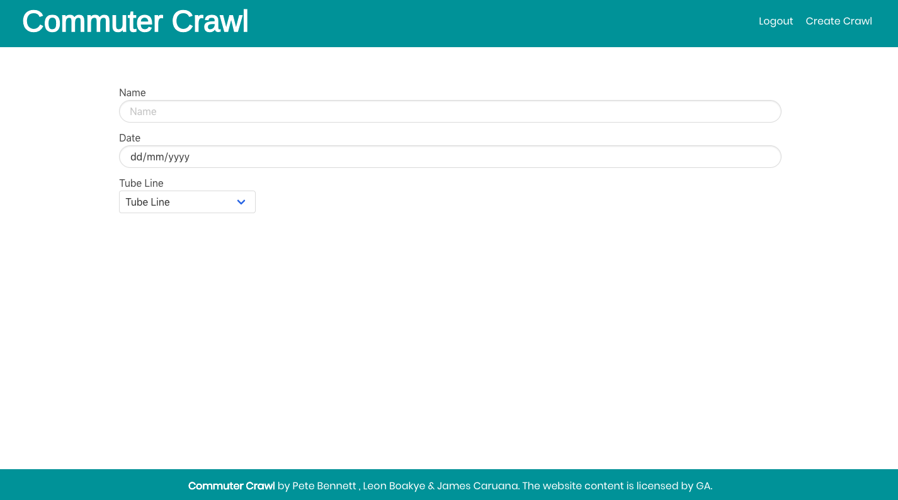
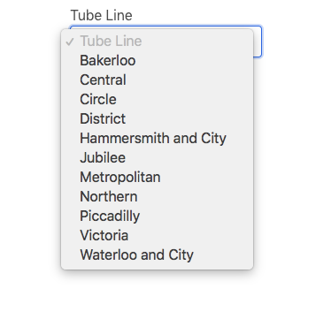
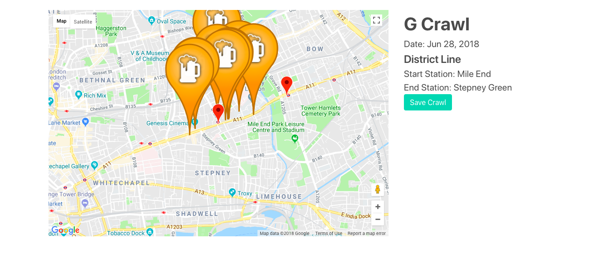
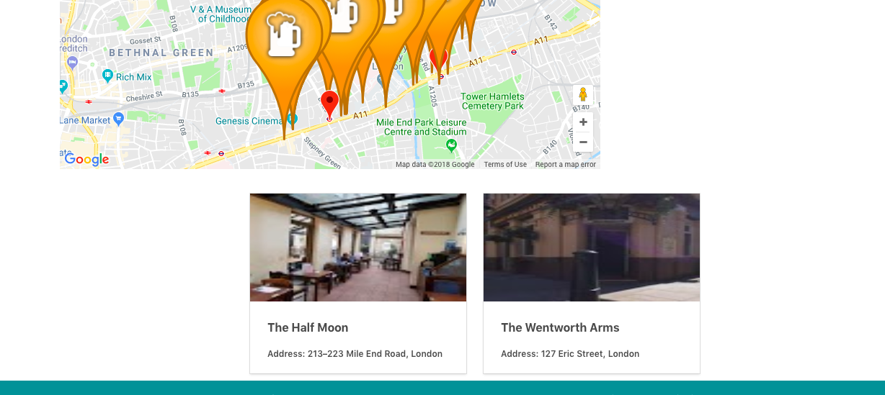
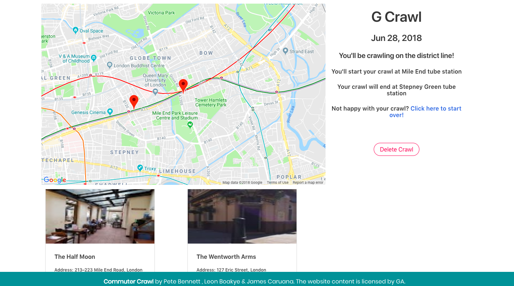

# Project 3: Commuter Crawl (GROUP PROJECT)

### Overview
Commuter Crawl allows users to plan a pub crawl based along tube lines. This was a group project built using AngularJS.

## Project Brief

### Necessary Deliverables

* A **working API, built by the whole team**, hosted somewhere on the internet
* A handmade Angular front-end **that consumes your own API**, hosted somewhere on the internet
* A **link to your hosted working app** in the URL section of your Github repo
* A **team git repository hosted on Github**, with a link to your hosted project, and frequent commits from _every_ team member dating back to the _very beginning_ of the project

### Technical Requirements

* **Carefully plan wireframes** as a team _before starting to code_
* **Carefully plan Model schemas*** as a team _before starting to code_
* **Manage team contributions and collaboration** using a Git on Github
* **Deploy your application online** so it's publicly accessible

#### Server-side

Your app must:

* **Use Mongo, Node & Express** to build a server-side API
* **Your API must have at least 2 related models**, one of which should be a user
* Your API should include **all RESTFUL actions** for at least one of those models
* Include **authentication** to restrict access to appropriate users
* **Include at least one referenced or embedded sub-document**, however don't go crazy! You need to manage your time effectively...
* **Include automated tests** for at least one resource

#### Client-side

* **Use Angular** to build a front-end that consumes your API
* **Use SCSS instead of CSS**
* **Use Webpack & Yarn** to manage your dependencies and compile your source code

---

### [Heroku](https://commuter-crawl.herokuapp.com/#!/)

### [GitHub Repo (my fork)](https://github.com/Petemab/Commuter-crawl)

### [GitHub Repo (that we used during the project)](https://github.com/jcaruana09/GROUP-PROJECT-WDI33)

 ---

### Technologies:

For this project we used the following technologies:

* HTML5
* SCSS
* JavaScript (ECMAScript 6)
* AngularJS
* Node JS
* express
* mongoose
* bcrypt
* Git
* GitHub
* Heroku
* Trello
* Balsamiq
* Webpack
* Yarn

---

### APIs Used:

For this project we used the following APIs:

* Google Maps API
* Google Places
* TFL

---

### Trello

Obviously good planning was vital on this project given we were not used to coding on the same project. We made good use of a Trello board which helped us work out what to do next, particularly during the periods we were not working in the same place.   

---

### Screenshots
Some Screen Shots

Home Page:

Registration Page:

New page - select name, date and tube line:

Tube stations plotted on G map - click to search for pubs:

Click on pub markers to select and add to crawl:

Show page:

---

### Challenges and Problems

* The biggest challenge with this project was working in a group, particularly given all three of us were trying to get to grips with both Angular while at the same time building the app. We tried to ensure we communicated frequently, either in person or over Slack and kept the Trello board updated. Despite this it was still tricky.

* Myself and James focused a lot of our attention on the new page, which was quite a challenge. We spent a lot of time ensuring we were getting the correct info from our http request to the TFL api and that that info was then used to make a request to plot Google markers. While this would probably seem fairly easy to a more experienced developer, it was new to us both it took a lot longer than we'd expected.

* Another challenge of group work on a new framework was understanding each others code! While we knew what each other were trying to achieve, we often got confused as to how the others had approached issues due to unfamiliarity with Angular. In retrospect we should have commented our code much more thoroughly.

* The edit page also proved tricky. As so much of the content for the form came from http requests it seemed illogical to pre fill a new form. In the end, and due to time constraints, we opted to just give users the chance to delete and start again.

* The styling left something to be desired, and I'd want to try and change the whole look of the app.

---

### Wins

* It works! The app does what it says it will, even if the code is perhaps not as neat and tidy as I would have hoped.

* We managed to overcome quite a complicated issue with the external APIs.

* We made MVP and gave ourlselves a platform on which to build further.

---

### Future Features

Features I would have liked to include:

* I would have loved to have included a feature to share the pub crawls via email/text with something like nodemailer.

* Adding Google Routes to show distance between bars and stations would also add something.

* I would like to restyle the app, which I tink would lift it a lot.

* It would be interesting to try and replicate in a new framwork.
